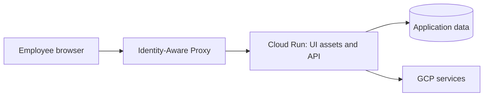

# Shared application architecture

Status: proposed blueprint. Read the [framework decision](../framework-decision.md) before choosing an implementation.

## Deployment unit

Start with one website and one Cloud Run service. A production build places frontend assets alongside the backend, serving `/api/*` and the UI from one origin. Local development can use a Vite proxy. An API error must remain JSON; an unknown API route must never fall through to the SPA HTML fallback.



For multiple websites, group deployable pairs by website:

```text
apps/
  admin/
    web/                    # browser package
    api/                    # backend package
  approvals/
    web/
    api/
packages/
  ui/                       # browser-safe shared components
  contracts/                # browser-safe API schemas/types
  identity/                 # server-only IAP verification
  config/                   # shared build/lint configuration
```

Each website can have its own image, service identity, IAP policy, and release schedule. Keep sections in one app when ownership, access, and releases are shared. A monorepo does not require microservices, a shared database, or a single deployment.

## Boundaries

- Routes/controllers translate HTTP. Business services implement use cases and permissions. Repositories/adapters handle external data access.
- Avoid introducing a service/repository interface for every trivial function; add boundaries where they separate real responsibilities or enable meaningful tests.
- Apps may import shared packages; shared packages must not import apps. Apps must not import each other's implementation.
- Browser code may import only browser-safe contracts and UI packages. It must not import server configuration, credentials, identity verification, or database code.
- Share behavior after demonstrating reuse. App-specific roles, workflows, and data models remain local unless their semantics are truly shared.

## Identity and authorization

IAP controls entry. Verify the signed IAP assertion with Google's supported library, configured issuer/audience, signature and time checks; derive a stable principal from verified claims. Use the audience appropriate to the actual IAP resource, not a copied example for another deployment mode. Do not use a decoded-but-unverified JWT or an unsigned email header as identity.

The service's GCP identity and the employee identity have different purposes. The former accesses GCP resources; the latter drives application permissions and audit records. Make read, edit, approve, export, and record-scope rules explicit in the application. Authentication alone does not grant every action.

IAP is framework-independent. For a new service, prefer direct Cloud Run IAP where it meets requirements. If using load-balancer IAP, prevent direct service access from bypassing that boundary. Do not enable IAP at both layers. See [Cloud Run IAP](https://docs.cloud.google.com/run/docs/securing/identity-aware-proxy-cloud-run) and [signed assertion verification](https://docs.cloud.google.com/iap/docs/signed-headers-howto).

Local development can inject a fake identity through a test/local adapter. Make production fail at startup if the local adapter is enabled. Tests must prove the production mode rejects missing/invalid assertions and local bypass configuration.

## API conventions

- Validate untrusted input at the boundary and enforce bounded pagination, field sizes, and allowed sort/filter fields.
- Define response contracts explicitly; avoid returning raw database entities containing internal fields.
- Use a stable error shape such as `{ "error": { "code": "FORBIDDEN", "message": "You cannot edit this record.", "requestId": "..." } }`. Validation errors may add field details. Do not expose stack traces or credentials.
- Choose and document conflict behavior: optimistic version checks for concurrent edits, transactions for atomic changes, and idempotency for retryable side effects where needed.
- Every state-changing route needs a documented CSRF strategy compatible with IAP/browser cookies; authentication and same-origin hosting alone are not that strategy.
- Keep business data out of logs by default; record structured audit events for sensitive mutations and exports.

## Builds and rendering

Proposed tooling baseline: npm workspaces with a committed lockfile, strict TypeScript, and one supported Node LTS version pinned consistently across development, CI, and containers. Select exact dependency versions when implementing and verify compatibility; these blueprints do not pin an untested application dependency graph.

Every runnable workspace should expose documented `dev`, `build`, `typecheck`, `lint`, and meaningful `test` commands. Do not put success-only placeholder commands in place of checks. CI must include reverse dependents of changed shared packages; running all app checks is a good initial choice for a small monorepo.

React + Vite defaults here to CSR. Neither backend blueprint supplies React SSR. If request-time React SSR becomes a requirement, record a rendering ADR and evaluate Next.js or React Router Framework Mode. Keep existing backend services only where independently useful. See [React Router rendering](https://reactrouter.com/start/framework/rendering) and [Next.js deployment](https://nextjs.org/docs/app/getting-started/deploying).

## Delivery contract

Cloud Run containers listen on `0.0.0.0` and the injected `PORT`, handle shutdown, and keep durable state outside container memory/files. Set request budgets, bounded downstream timeouts, database pool limits, instance caps, and concurrency together. Validate using the real workflow rather than a user-count estimate. See the [Cloud Run container contract](https://docs.cloud.google.com/run/docs/container-contract).

Use separate Cloud Run functions for appropriate event handlers; do not assume a full application server can be substituted for the Functions Framework entrypoint. Keep service-to-service/event invocation distinct from employee browser authentication.

See [production readiness](production-readiness.md) and copy the [runbook template](../templates/runbook.md) for a concrete service.
